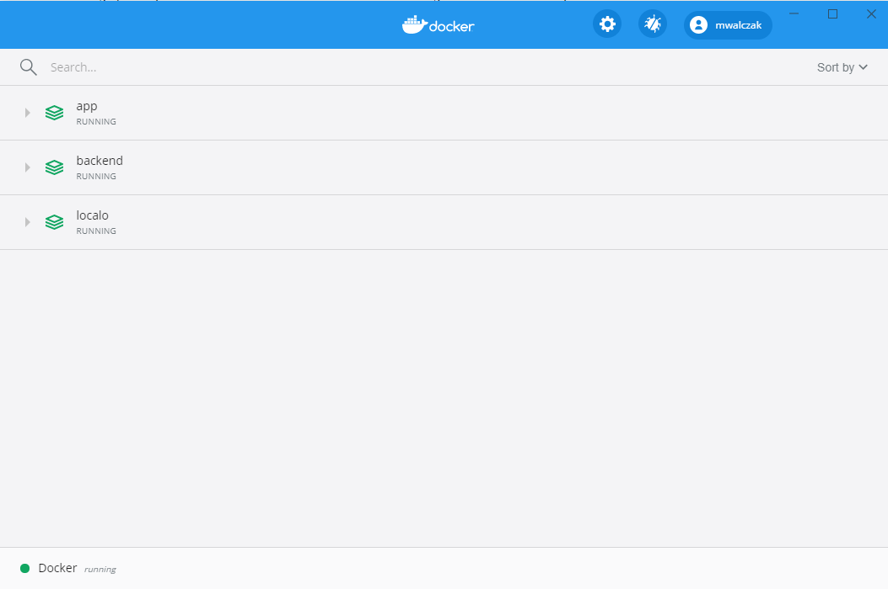
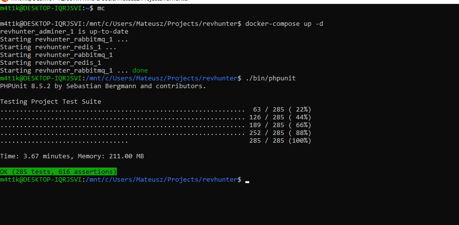
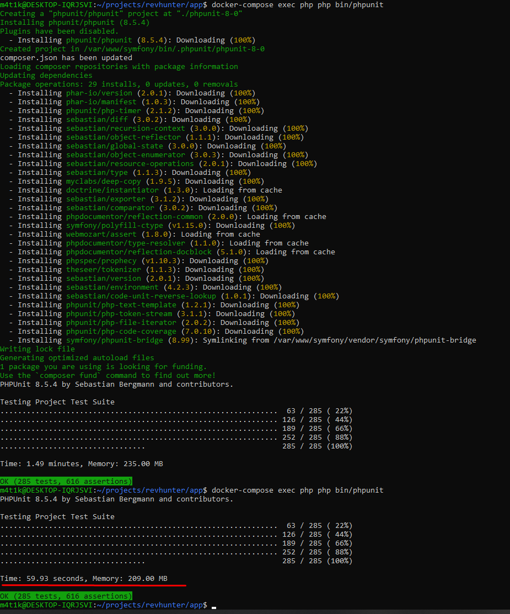

# How-to setup Windows 10 with WSL2 to speed up Symfony development

#### 1. Install Windows 10 build 2004 (before official release you must join Windows Insider)

More info (https://docs.docker.com/docker-for-windows/wsl-tech-preview/)

#### 2. Install Ubuntu 20.04 and Docker inside WSL

You can find Ubuntu in MS Store (https://www.microsoft.com/en-us/p/ubuntu-2004-lts/)

There are many tutorials how to install Ubuntu on Windows - follow one of them

When finished install docker with command:
```
sudo apt install docker.io
sudo apt install docker-compose
```

#### 3. Clone, setup and start your Symfony repo inside WSL.

#### 4. Mount your symfony repo from WSL to Windows (not the oposite way). You can find wsl network using path below or similar in Windows explorer
```
\\wsl$\Ubuntu-20.04
```

#### Pros:
- Huge impact on symfony loading speed (see performance tests below)
- Way quicker local dev stack using docker-compose and no need to install dependencies locally, see example [stack](https://github.com/mwalczak/cards/blob/master/docker-compose-dist.yml) 
- Now you can start developing Symfony using full docker env in Windows. All docker-compose projects run within WSL are in Windows docker 
- Multiple projects development is possible and quite easy (I use different ports exposed in coker-compose.yml) 

#### Cons:
- Slower file sync in IDE can sometimes make it (ex. PhpStorm) unstable

#### Performance tests (using on of my projects):
- WSL1 with local php - **3.67min**: 
- WSL2 with full docker env (first with install and second run) - **< 1min**: 
- Symfony5 full stack loading time: 

